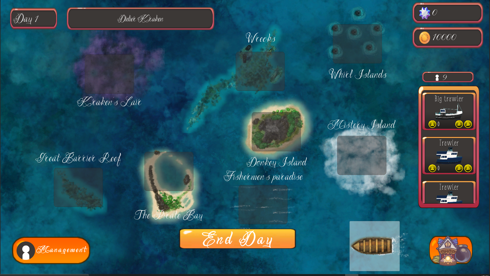
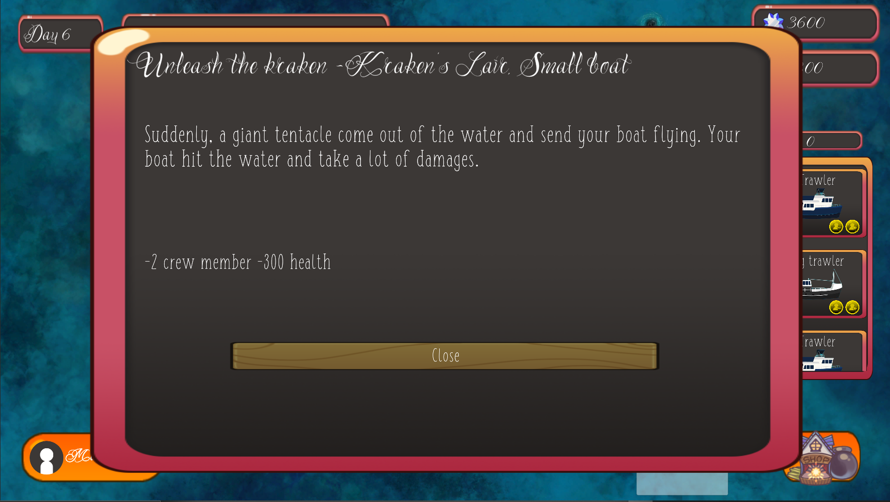
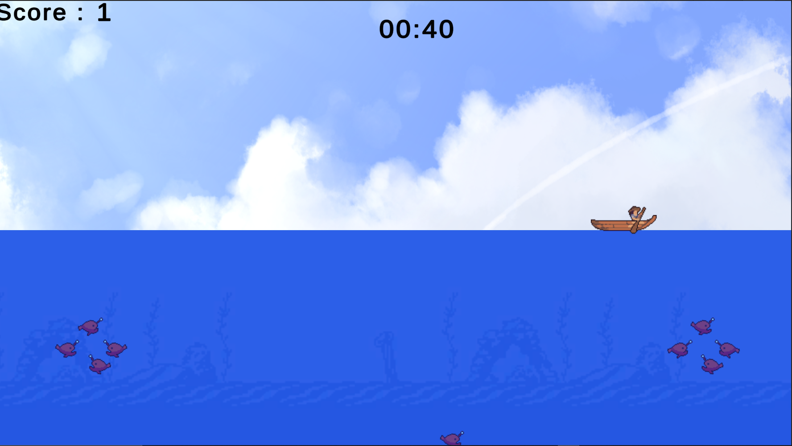

# Didier Kracken's Down The Sea

Gestion game made for the Mundane Jam (8 Bits To Infinity) where you have to manage your fishing boats in order to make money and hold on as long as possible.

## Overview

Unity version: 2020.2

Check out our Itch.io page [here](https://quentinsauvage.itch.io/didierkrakensdownthesea) for more info.
